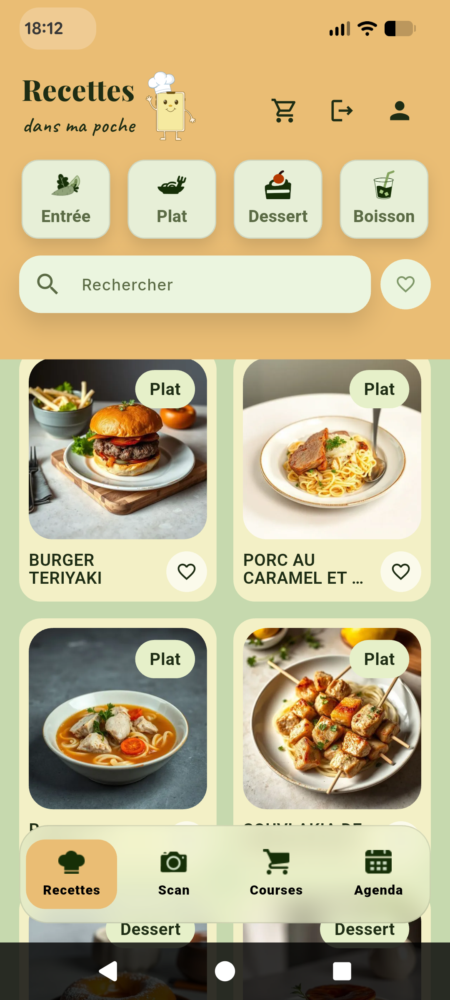
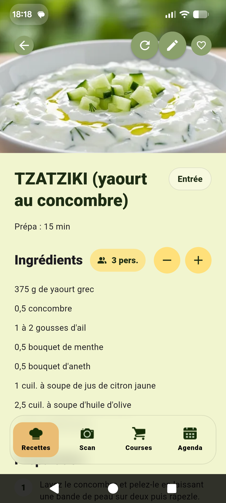
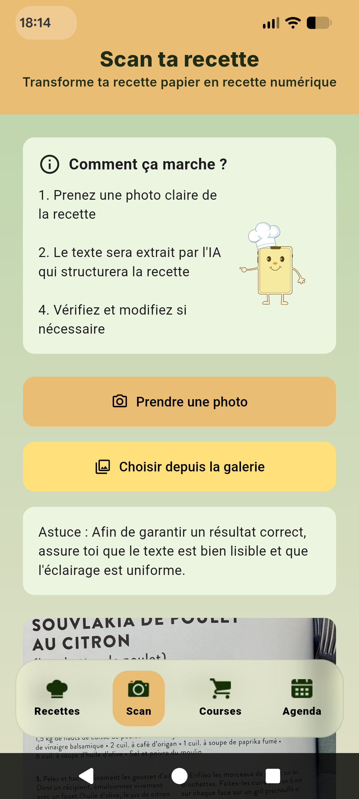
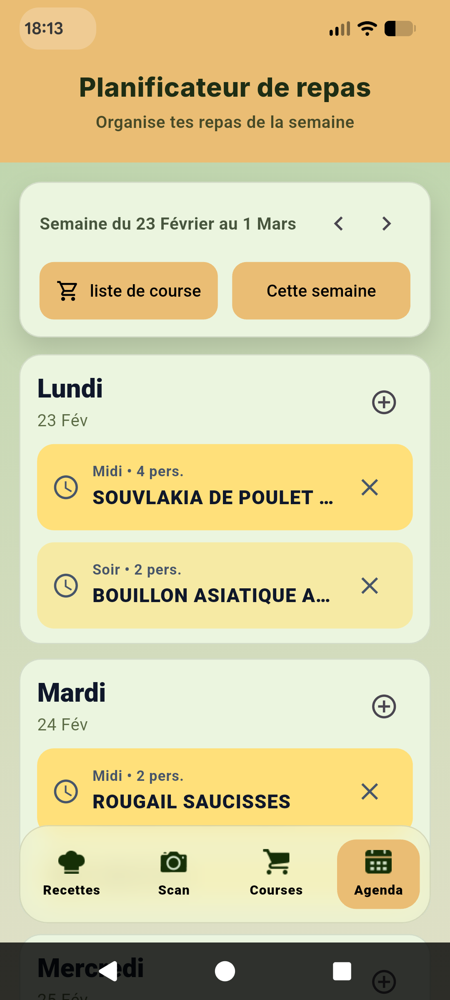
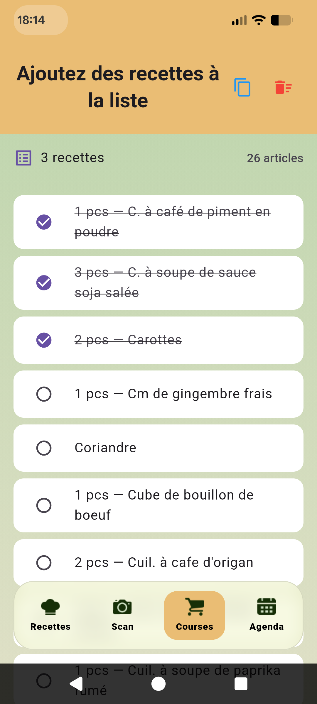

# Recettes dans ma poche

Application mobile intelligente permettant de scanner des recettes papier et de les transformer automatiquement en recettes numériques structurées, avec génération d’image IA.

---

## 📸 Screenshots

<p align="center">
  
  
  
  
  
</p>

---

# 🇫🇷 Version Française

## Description

Recettes dans ma poche est une application mobile développée avec Flutter permettant de :

- Scanner une recette depuis un livre de cuisine
- Nettoyer et corriger automatiquement le texte OCR
- Structurer la recette via intelligence artificielle
- Générer automatiquement une image réaliste du plat
- Stocker les recettes dans le cloud

L'application transforme vos livres de cuisine physiques en base de données numérique enrichie par l’IA.

---

## Intelligence Artificielle

L’application utilise :

- **Gemini 2.0 Flash** pour :
  - Classification automatique (entrée / plat / dessert / boisson)
  - Extraction structurée (JSON strict)
  - Détection portions, temps de cuisson, ingrédients, étapes
- Post-processing intelligent :
  - Correction automatique OCR (français)
  - Nettoyage du texte
  - Validation stricte du JSON
  - Fallback si le modèle retourne une réponse partielle

---

## Génération d’image automatique

Chaque recette génère automatiquement :

- Une image réaliste du plat
- Créée via **Imagen 3 (Vertex AI)**
- Prompt dynamique basé sur :
  - Titre
  - Catégorie
  - Ingrédients détectés
  - Type de plat (salade, soupe, brochette, etc.)
- Restrictions strictes pour éviter :
  - Ingrédients inventés
  - Texte sur l’image
  - Éléments parasites

L’image est :

- Optimisée en WebP (Sharp)
- Stockée dans Firebase Storage
- Liée à la recette

---

## Backend & Architecture

- Firebase Functions v2 (Node.js)
- Firestore (stockage recettes)
- Firebase Storage (images générées)
- Auth Firebase (sécurisation endpoints)
- Retry automatique en cas de quota IA (gestion 429)
- Transactions Firestore pour éviter double génération

---

## Fonctionnalités

- 📷 Scan de recette
- 🧹 Correction automatique OCR
- 🧠 Structuration intelligente
- 🏷️ Catégorisation automatique
- ⏱️ Calcul automatique du temps total
- 🎨 Génération d’image IA
- 🔄 Régénération contrôlée d’image
- 🔐 Sécurisation par token Firebase

---

## Technologies utilisées

### Mobile

- Flutter 3.38.6 (stable)
- Dart 3.10.7

### Backend

- Firebase Functions v2
- Firestore
- Firebase Storage
- Sharp (image processing)
- Google Gemini API
- Vertex AI (Imagen 3)

---

## Installation

```bash
git clone https://github.com/Mehdi-Mouilbeau/recettes_magiques.git
cd recettes_magiques
flutter pub get
flutter run
```

# 🇬🇧 Description (English)

## Recettes dans ma poche

An intelligent Flutter mobile application that transforms scanned cookbook recipes into structured digital recipes enriched with AI-generated images.

---

## Overview

Recettes dans ma poche is a mobile application built with Flutter that allows users to scan recipes from physical cookbooks and automatically convert them into clean, structured digital recipes.

The application leverages Artificial Intelligence to extract, clean, classify, and enrich recipe data — including automatic image generation.

---

## AI-Powered Recipe Processing

The backend uses **Google Gemini 2.0 Flash** to:

- Automatically classify recipes (starter / main / dessert / drink)
- Extract structured JSON data from OCR text
- Detect servings count
- Extract preparation and cooking times
- Parse ingredients and steps
- Generate relevant tags

### Advanced Post-Processing

After AI extraction, the system applies:

- OCR normalization and auto-correction (French language optimized)
- Strict JSON validation and sanitization
- Ingredient and step cleanup
- Category validation
- Automatic total time calculation
- Intelligent fallback reconstruction if AI output is incomplete

This ensures robust and reliable recipe structuring.

---

## Automatic AI Image Generation

Each recipe automatically generates a photorealistic dish image using **Imagen 3 (Vertex AI)**.

### Smart Prompt Engineering

Image prompts are dynamically generated based on:

- Recipe title
- Category
- Detected ingredients
- Dish type (salad, soup, skewers, stew, etc.)

### Strict Visual Constraints

To ensure realistic and relevant images:

- No invented ingredients
- No pasta/rice if not present in recipe
- No text overlays
- No UI elements
- No logos or watermarks
- Food-only photography style
- Neutral tabletop composition
- DSLR shallow depth-of-field look

### Image Processing

- Generated as JPEG via Imagen
- Converted to optimized WebP using Sharp
- Resized to 512x512
- Stored in Firebase Storage
- Linked to Firestore documents

---

## Backend Architecture

Built with:

- Firebase Functions v2 (Node.js)
- Firestore (recipe storage)
- Firebase Storage (image storage)
- Firebase Authentication (secure endpoints)
- Google Gemini API
- Vertex AI (Imagen 3)
- Sharp (image processing)

### Reliability Features

- Automatic retry system for rate limits (HTTP 429 handling)
- Firestore transactions to prevent duplicate image generation
- Secure token verification for protected endpoints
- Controlled image regeneration with usage limits

---

## Features

- 📷 Recipe scanning
- 🧹 OCR text normalization
- 🧠 AI-powered structuring
- 🏷️ Automatic categorization
- ⏱️ Cooking & preparation time detection
- 🧮 Total time calculation
- 🎨 AI image generation
- 🔄 Controlled image regeneration
- 🔐 Secure backend endpoints

---

## Technologies

### Mobile

- Flutter 3.38.6 (stable)
- Dart 3.10.7

### Backend

- Firebase Functions v2
- Firestore
- Firebase Storage
- Google Gemini (gemini-2.0-flash)
- Vertex AI (Imagen 3)
- Sharp

---

## Installation

```bash
git clone https://github.com/Mehdi-Mouilbeau/recettes_magiques.git
cd recettes_magiques
flutter pub get
flutter run
```
